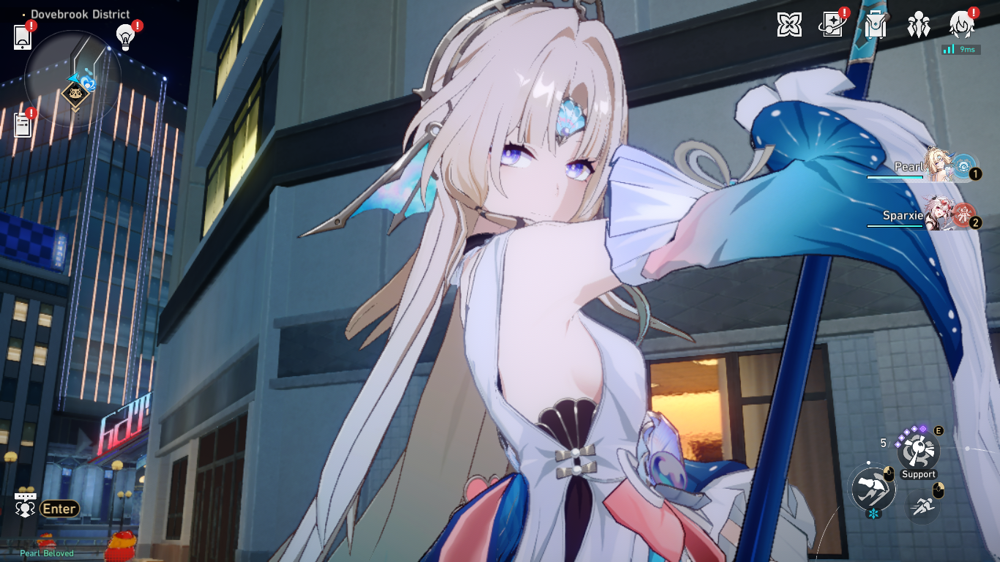

<div align="center">
<h1>Planarcadia</h1>
</div>

# How to Run (Windows)
1. Install [zig 0.14.1](https://ziglang.org/download/0.14.1/zig-x86_64-windows-0.14.1.zip)
2. Build
- Run the server ```zig build run-program```
- Build release ```zig build -Doptimize=ReleaseSafe```

</img>

# List that i added
- [x] Lua Execute
- [x] SRTools sync

For HSR 4.5.51

# Thanks To
- [Reversed Rooms](https://discord.gg/reversedrooms)
- [Based On Project](https://git.xeondev.com/HonkaiSlopRail/pearl-sr)
